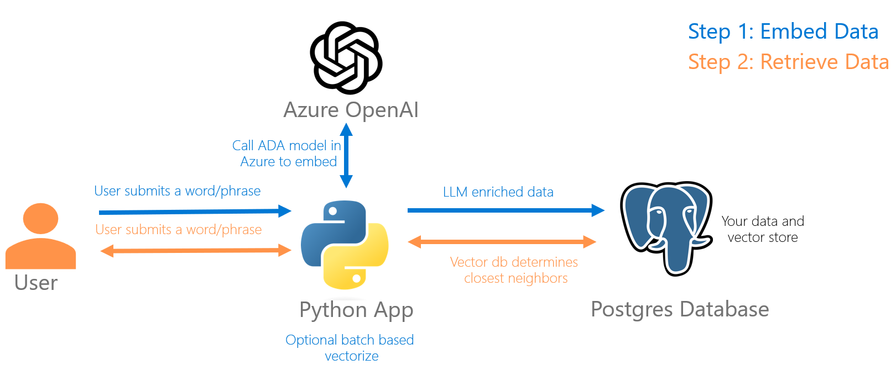
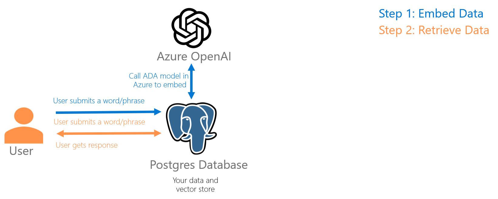

## Postgres pgvector and azure_open_ai demo examples
This is a simple demo solution to show two scenarios around how applications can connect to Azure Open AI to embed data, then store the results in a Postgres vector database.

### Scenario 1: Embedding using a Python application

In this scenario, a Python application connects to Azure Open AI to embed data, then stores the results in a Postgres vector database.  You can run the provided python apps to insert data into the database, and then query the database to see the results.

### Scenario 2: Embedding using Postgres azure_open_ai extension

In this scenario, a Postgres database connects to Azure Open AI to embed data, then stores the results in a Postgres vector database.  There is a SQL script provided to create the database and run the embedding.

Note: in either scenario you will need to have a provision Azure Open AI resource and a Postgres database with the pgvector extension installed.